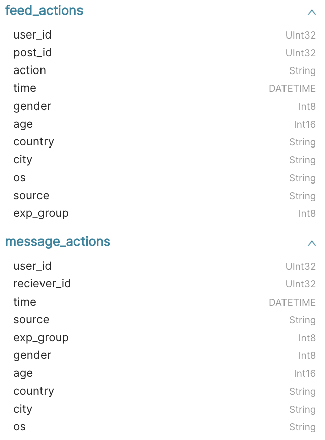
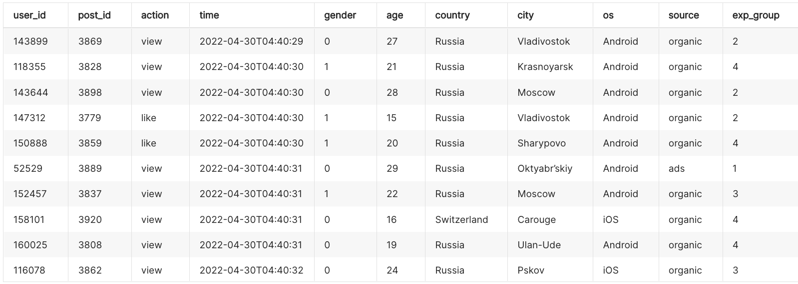
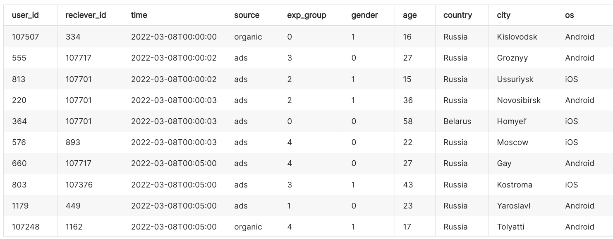

# КУРС «СИМУЛЯТОР АНАЛИТИКА»
6 поток, 20.04.2022   
Ссылка на описание курса: https://karpov.courses/simulator  

## Описание уроков
- **lesson 1** – ВВЕДЕНИЕ В КУРС
- **lesson 2** – ЗНАКОМИМСЯ С РАБОЧИМ ОКРУЖЕНИЕМ
- **[lesson 3](./lesson_3/)** – ПЕРВЫЙ ДАШБОРД
- **[lesson 4](./lesson_4/)** – АВТОМАТИЗАЦИЯ ОТЧЕТНОСТИ
- **[lesson 5](./lesson_5/)** – ПОИСК АНОМАЛИЙ (СИСТЕМА АЛЕРТОВ)
- **[lesson 6](./lesson_6/)** – АНАЛИЗИРУЕМ ПРОДУКТОВЫЕ МЕТРИКИ
- **[lesson 7](./lesson_7/)** – ЗАПУСКАЕМ А/B-ТЕСТЫ
- **[lesson 8](./lesson_8/)** – ПОСТРОЕНИЕ ETL-ПАЙПЛАЙНА
- **[lesson 9](./lesson_9/)** – ПРАКТИЧЕСКИЕ ЗАДАЧИ*

## Стек
- ClickHouse — колоночная база данных для хранения пользовательских событий;
- Redash — инструмент для написания SQL-запросов и базовой визуализации;
- Superset — полноценная BI-система;
- Jupyter Lab — среда для написания кода на Python;
- GitLab — репозиторий для хранения кода.
- Airflow — инструмент для автоматизации рабочих задач и их запуска в соответствии с расписанием

## Данные
Есть 2 таблицы:  

feed_actions:

message_actions:
