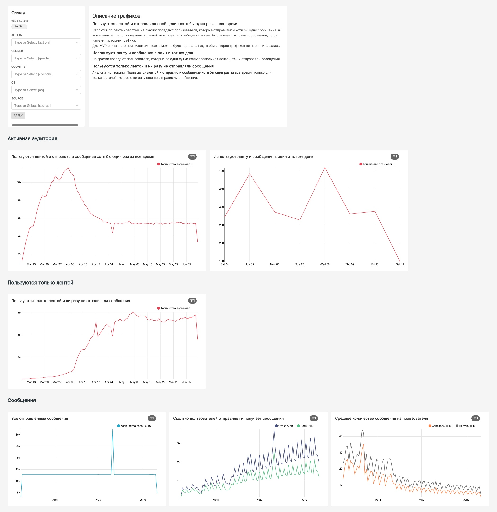

# Задание 1
Мы выяснили, что главный вопрос, на который должна отвечать аналитика на самом начальном этапе — это вопрос «сколько?».  

На практике это означает, что если нам поручили настроить аналитику продукта, нужно начать с нескольких базовых дашбордов, которые покрывают собой ключевые аудиторные метрики и ключевые события нашего продукта. В лекции мы заложили основу двух дашбордов по ленте новостей, ваша задача теперь доделать эти дашборды. Подумайте, какие еще графики, срезы, метрики имеет смысл добавить на дашборды. С чего начать? Может, например, стоит как-то отобразить число событий на одного юзера?  

## Основной дашборд за прошлое время
Запросы для графиков:
- [Retention rate (day by day)](retention_day_by_day.sql)
- [Lness – количество активных дней в неделю](lness.sql)
- [Stickiness](stickiness.sql)

## Оперативный дашборд с графиками за сегодняшний день

# Задание 2
Постарайтесь при помощи дашборда ответить на следующие вопросы:

1. Какая у нашего приложения активная аудитория по дням, т.е. пользователи, которые пользуются и лентой новостей, и сервисом сообщений. 
2. Сколько пользователей использует только ленту новостей и не пользуются сообщениями.   

## Лента и сообщения
